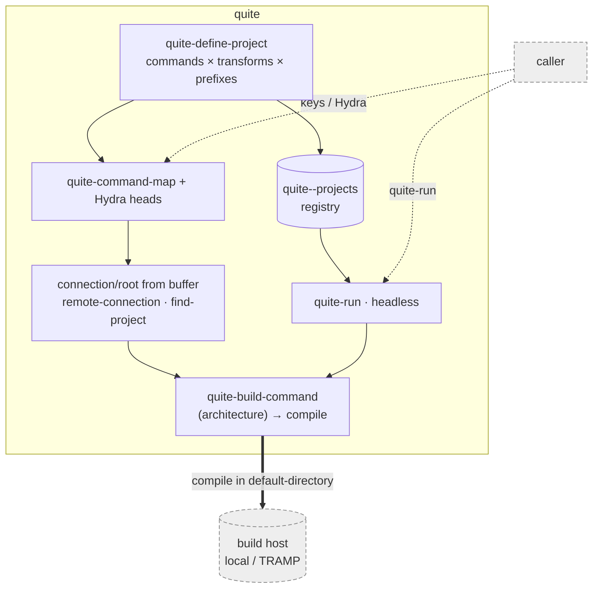

# Contributing to quite

quite is one Emacs-Lisp file (`quite.el`). This is the developer's map: the
architecture, the two entry surfaces, the project data model, the public API, the
extension points, and the important internals.

## Layout

- `quite.el` — the whole package (one file, `;;;`-sectioned).
- `tests/quite-tests.el` — buttercup specs (pure; no network/repo).
- `README.md` — user-facing overview + comparison.

## Architecture

quite has a simple job: **organize a matrix of build commands and point `compile`
at the right host and root.** Remoteness is free — `compile` with a remote
`default-directory` runs on the remote host via TRAMP; quite just resolves *which*
connection/root and *which* command. A generic **caller** (a keybinding, a Hydra, or an
orchestrator) drives quite; the **build host** is local or any TRAMP remote.



## Two entry surfaces

1. **The per-project matrix** — `quite-define-project` takes a project plist and
   composes *commands × transforms × prefixes* into (a) bindings in
   `quite-command-map` (via `quite-bind-project-commands`) and (b) Hydra heads
   (via `quite-project-hydra-heads`). Interactive: the raw prefix argument selects
   a *flavor* (`quite--prefix-arg-index` / `quite--dispatch`), and the command
   runs in a named compilation buffer whose connection/root come from the
   **current buffer** (`quite-remote-connection-for-current-buffer`,
   `quite-project-find-project`).
2. **`quite-run` (headless)** — `quite-run NAME COMMAND &optional DIR BUFFER-NAME`
   looks the project up in `quite--projects`, builds the command with
   `quite--project-build-command`, and runs it via `compile` in `DIR` (a remote DIR
   builds remotely) — no keymap, Hydra, or file-visiting buffer required. This is
   the integration entry a tool (e.g. a PR-work orchestrator) calls; it reuses the
   same build command as the matrix, so headless and interactive builds match.

Both bottom out in `quite--project-build-command`, which returns a
`(CONNECTION ROOT SUBDIR BUFFER TAG)` function that runs one `compile`.
CONNECTION is nil for local, or a TRAMP prefix such as `/ssh:me@host#2222:` —
**not** a bare host, which could not tell a user, port, method or hop apart.
*How* a
command becomes a command line is the project's **build architecture**: the
generic `quite-build-command` dispatches on the project's
`:build-architecture` symbol, defaulting to `git-project`.

- `git-project` — runs `"PREFIX git GIT-NAME COMMAND TAG POSTFIX"`. What quite
  grew up driving, and still the default.
- `shell` — runs a command's `:shell-command` verbatim, wrapped in
  `:command-prefix`/`:command-postfix`. For a project built by its own tooling
  (a `./check.sh`, make, hatch, cask). It has nowhere to interpolate a tag, so
  it ignores one.

Teach quite a new architecture by adding a `cl-defmethod` on
`quite-build-command`; no change to quite itself is needed. Execution is
ordinary `compile`; quite only assembles the command line and sets the
directory.

## Data model

- **Project plist** (argument to `quite-define-project`, also stored in
  `quite--projects` keyed by `:name`):
  - `:name` — project name (buffer names, Hydra columns, `quite-run` key).
  - `:descriptor` — a `quite-project-descriptors` plist (below).
  - `:prefix-key` — key prefix (after `C-c`) for the bindings.
  - `:target` — target string used in flavor (tag) names.
  - `:commands` — list of `(:name :command :key)` plists. `:command` is the
    command's **lookup name** — the verb `quite-run`/`quite-run-repo` search for,
    conventionally `"build"` or `"check"`. The `shell` architecture additionally
    requires `:shell-command`, the line to run.
  - `:build-architecture` — *optional* symbol selecting how commands run
    (`quite-build-command`); defaults to `git-project`.
  - `:git-name` — the git-project name in the compile command (`git-project`
    architecture only).
  - `:prefixes` — *optional* list of prefix-name strings; **list order = the C-u
    index** (position 0 = no prefix, 1 = one `C-u`, …). Omit for a project with a
    single build flavor.
  - `:transforms` — *optional* list of `(:name :func)` plists; `:func` maps a
    command key to its variant (e.g. `identity`, `upcase`). Defaults to one
    unnamed identity transform. Flavor names drop absent components, so omitting
    either dimension shortens the tag rather than leaving a stray hyphen.
  - `:command-prefix` / `:command-postfix` — optional shell text around the
    compile command (e.g. activating a venv).
- **Descriptor plist** (`quite-project-descriptors`): `:project-dir`,
  `:root-list` (candidate roots to search on the host), `:key-files` (files that
  identify the root).
- **`quite--projects`** — alist `NAME → project-plist`, populated by
  `quite-define-project`; the lookup table behind `quite-run`.
- **`quite-descriptors`** — a separate, general dispatch list for `quite-execute`:
  plists of `(:function :tag)` chosen by prefix argument (independent of the
  per-project matrix).

## Public API

- **Define / run:** `quite-define-project` (usual overlay entry point),
  `quite-run` (headless), `quite-execute` (prefix-dispatch over
  `quite-descriptors`), `quite-bind-project-commands`, `quite-project-hydra-heads`.
- **Connection/root:** `quite-remote-connection-for-current-buffer`,
  `quite-remote-connection`, `quite-remote-path`, `quite-remote-localname`,
  `quite-remote-display-host`, `quite-remote-localhost` (returns nil = local),
  `quite-project-find-project`.
- **Dispatch:** `quite-generate-dispatcher`, `quite-generate-buffer-dispatcher`.
- **Build architectures:** `quite-build-command` (generic; `cl-defmethod` on a
  `:build-architecture` symbol to add one). Built in: `git-project`, `shell`.
- **Config (defcustom):** `quite-descriptors`, `quite-project-descriptors`,
  `quite-flavor-abbreviations` (regexp→replacement, shortens Hydra head labels),
  `quite-remote-method` (TRAMP method used ONLY when quite must invent a
  prefix, i.e. the buffer visits no file; default `ssh`).

## Important internals

- `quite--project-build-command` — resolves a project's architecture and returns
  the command builder (used by both surfaces); `quite--make-build-command` is the
  `git-project` architecture's builder.
- `quite-remote--prefix` — the one place a `/method:host:` prefix is built,
  from `quite-remote-method`. It is reached only when there is no buffer prefix
  to copy. Add no second literal method anywhere.
- `quite-remote-connection` / `quite-remote-localname` — the connection
  round-trip. Extraction prefers the literal prefix (path minus localname),
  guarded by `string-suffix-p` and falling back to `file-remote-p`; stripping
  is `file-local-name`, so it handles any method, user, port or hop. Never
  reintroduce a hand-written prefix regexp: the old one silently failed on a
  `#port`, because `#` fell outside its character class.
- `quite--connection-token` — buffer-name identity. Hashes the WHOLE connection
  string, because a host alone cannot separate two users, ports, methods or
  hops, and two builds sharing a buffer name share one process.
- `quite--dispatch` / `quite--prefix-arg-index` — prefix-argument → flavor index
  (nil/0 → #1, 4 → #2, 16 → #3, …).
- `quite--run-in-buffer-context` / `quite--generate-buffer-action` /
  `quite--make-buffer-name` — run a command in a (created or reused) named
  compilation buffer.
- `quite-project-find-project` — resolves the root from the current buffer, or by
  searching `:root-list` on the (possibly remote) host for `:project-dir` +
  `:key-files`; returns the prefix-less root. (Note: its search branch must
  *return* the found root — a missing else once made it return nil on a hit; keep
  the "return found-root on success" arm and its spec.)

## Local setup

Load quite from a checkout — elpaca `:try-local`, `package-vc`, `straight`, or a
plain `load-path` + `require`. Needs Emacs ≥ 28 and [`hydra`]; the tests need
[`buttercup`].

## Running the checks

There's no `check.sh` yet; the equivalent invocation (byte-compile with warnings
as errors, then buttercup) is:

```sh
ADD='(dolist (d (directory-files "~/.emacs.d/elpaca/builds" t "^[^.]"))
       (when (file-directory-p d) (add-to-list (quote load-path) d)))'
emacs -batch -Q --eval "$ADD" --eval '(setq byte-compile-error-on-warn t)' \
  -L . -f batch-byte-compile quite.el && rm -f *.elc
emacs -batch -Q --eval "$ADD" -L . -L tests -l buttercup -f buttercup-run-discover
```

Green means **no byte-compile warnings and every spec passes.**

## Conventions

- Docstrings wrap at 80 columns.
- Specs exercise the pure layer — connection/root resolution mocks
  `file-exists-p` / `system-name`; dispatch and command composition are tested
  without a real `compile`.
- **TRAMP name parsing is the deliberate exception: do NOT mock it.** Those
  specs call the real `file-remote-p` and `file-local-name`, because parsing
  needs no network and stubbing them would stub the exact behavior the
  connection model rests on. A hop spec must additionally pass its name through
  `expand-file-name` (quite reads `buffer-file-name`, which is canonical) and
  bind `tramp-default-proxies-alist`, since TRAMP records an ad-hoc route
  there. Version-gate hop expectations on `(boundp 'tramp-show-ad-hoc-proxies)`:
  Emacs 28.x keeps an inline hop, 29.2+ drops it unless that option is set.
- Add a spec with any behavior change.
- **Run the negative control on a regression spec:** check it out against the
  OLD code and confirm it fails, and confirm the failure COUNT matches what you
  predicted. Two specs in this suite passed against the very bug they were
  written for — one asserted the wrong function was not called, the other left
  `locate-dominating-file` unstubbed so both versions returned nil.
- quite is a **generic** build organizer — it names no consumer. New integration
  points (like `quite-run`) are plain functions/registries any caller can use.

[`hydra`]: https://github.com/abo-abo/hydra
[`buttercup`]: https://github.com/jorgenschaefer/emacs-buttercup
