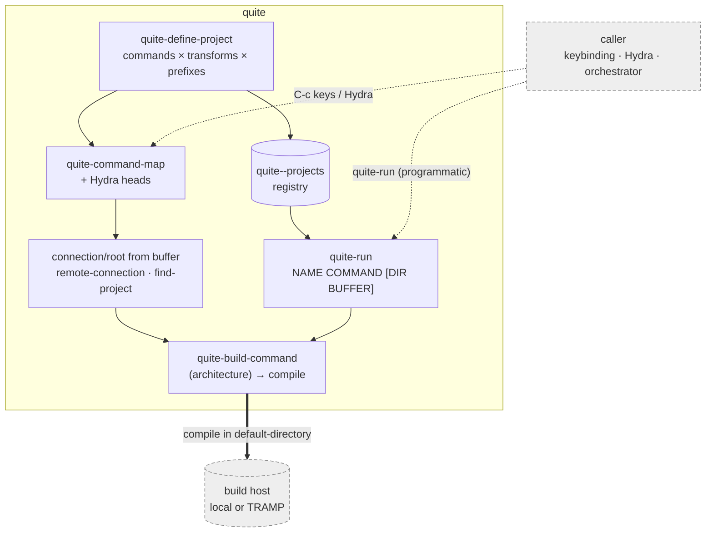

# quite: QUIck Transparent Execution

`quite` runs a project's build and development commands **on the host where the
file you are editing actually lives**. That is your local machine when the
current buffer visits a local file, or a remote host (over TRAMP) when it visits
a remote file. You do not have to think about which. It works out the host and
the project root from the current buffer, then runs the command there in a
dedicated, predictably named compilation buffer.

Its distinctive feature is **prefix-argument dispatch to command _flavors_**. A
single key runs, say, `build`, and the prefix argument selects *which* flavor of
that build to run. No prefix runs one flavor, `C-u` runs the next, `C-u C-u`
runs the one after and so on. `quite-define-project` composes a whole matrix of
*commands × transforms × flavors* into a keymap and a
[Hydra](https://github.com/abo-abo/hydra).

> Status: small, single-author package. The public surface is stable but the
> configuration is deliberately explicit (you describe your projects and command
> vocabulary yourself). For the trade-offs, see **quite: pros and cons** below.


*One prefix key reaches a grid of build variants (commands × flavors). Then the
same binding is pressed twice — `C-c q a b`, then `C-u C-c q a b` — and the
prefix argument selects a different flavor each time. Execution is ordinary
`compile`, so a remote `default-directory` builds on the remote host. (Example
data. The build command is stubbed to echo, so nothing real runs.)*


*The lead claim, shown rather than described. The buffer visits
`/ssh:demo-host:…/app/src/app.c` on another machine, and the same `C-c q a b`
builds **there**. Nothing about the project definition or the keys changes —
only the buffer. The compilation buffer's `default-directory` is the remote
root, and its name carries a hash of the connection, so two hosts never share
one buffer. (Example data. The build command is stubbed to echo, so nothing
real runs.)*

## What it does

- **The host follows the buffer.** `quite` inspects the current buffer with
  `file-remote-p`/`buffer-file-name`. A remote (`/ssh:host:…`) buffer runs the
  command on `host`. A local buffer runs it on the local machine. You use the
  same key either way.
- **Project discovery.** A *project descriptor* is a plist of `:project-dir`,
  `:root-list` and `:key-files`. `quite` either infers the project root from the
  buffer's own path, or searches the `:root-list` directories **on the resolved
  host** for `:project-dir` containing one of the `:key-files`.
- **Flavor dispatch.** Each command is bound once. The raw prefix argument
  indexes into an ordered list of flavors (e.g. `release` then `debug`), and the
  chosen flavor's tag is passed through to the shell command.
- **Composition.** `quite-define-project` turns a compact spec into (a) bindings
  in `quite-command-map` and (b) Hydra heads, so a project's whole build matrix
  is a few keystrokes away.

## Example

```elisp
(require 'quite)

;; Reach quite's commands under a prefix of your choosing.
(global-set-key (kbd "C-c q") quite-command-map)

(quite-define-project
 (list :git-name    "be"                       ; git-project sub-command name
       :name        "llvm"                      ; used in buffer names / hydra
       :descriptor  '(:project-dir "llvm-project"
                      :root-list ("~/ws")
                      :key-files ("Makefile"))
       :prefix-key  "r"                          ; keys live under C-c q r ...
       :target      "llvm-project"               ; used in flavor (tag) names
       :commands    '((:name "configure" :command "configure" :key "f")
                      (:name "build"     :command "build"     :key "b"))
       :prefixes    '("release" "debug")         ; list ORDER = the C-u index
       :transforms  (list (list :name "local"   :func #'identity)
                          (list :name "cluster" :func #'upcase))))
```

With the above, `C-c q r b` builds `llvm-project`'s `release` flavor locally.
`C-u C-c q r b` builds the `debug` flavor. `C-c q r B` (upcased key) builds the
`cluster` variant, and `C-c q r h` pops the project's build Hydra. If the buffer
you invoke from is remote, every one of those runs on the remote host instead,
using the same keys.

## How it works (the moving parts)

| Function | Role |
|---|---|
| `quite-remote-connection-for-current-buffer` | resolves the buffer's TRAMP connection, nil for local |
| `quite-project-find-project` | finds the project root on that connection (buffer-relative or by searching `:root-list`) |
| `quite--dispatch` / `quite--prefix-arg-index` | maps the raw prefix argument to a flavor index |
| `quite-generate-buffer-dispatcher` | builds the interactive command that runs a flavor in a named buffer |
| `quite-define-project` | composes commands × transforms × flavors into `quite-command-map` + Hydra heads |

Execution itself is ordinary `compile`, so remoteness is carried by
`default-directory`/TRAMP. `quite`'s job is to *point it at the right host and
root* and to organize the command matrix.

When the current buffer visits a file, `quite` copies **that file's own TRAMP
prefix** and uses it verbatim. Whatever the buffer already reached — a method,
a user, a port — is what the build reaches. So `/ssh:me@host#2222:/src/f.c`
builds as `me` on port `2222`, and nothing needs configuring.

`quite-remote-method` applies only where there is no name to copy: the buffer
visits no file, so the host comes from a prompt or from a descriptor's
`:default-host-func`. It defaults to `ssh`:

```elisp
(setq quite-remote-method "sshx")
```

### Hops

A hop is TRAMP's business, not `quite`'s, and how far an inline `|` hop
survives depends on your Emacs:

| Emacs | Inline `/ssh:bastion\|ssh:target:` |
| --- | --- |
| 28.x | kept in the file name, so `quite` copies it |
| 29.2+ | dropped by default; kept when `tramp-show-ad-hoc-proxies` is non-nil |

From 29.2, TRAMP rewrites an inline hop into `tramp-default-proxies-alist` as
*session* state, which `tramp-cleanup-all-connections` clears. For a hop that
survives everywhere, declare it there yourself — TRAMP's own mechanism:

```elisp
(add-to-list 'tramp-default-proxies-alist '("\\`target\\'" nil "/ssh:bastion:"))
```

Two different bastions reaching one target are ambiguous once the names
collapse, so that is not supported.

## How your commands actually run: `:build-architecture`

The examples above assume [`git-project`][gp], which is what `quite` grew up
driving. It composes `PREFIX git GIT-NAME COMMAND TAG POSTFIX`. That is the
default, and a project that omits `:build-architecture` gets it.

**Your project probably builds with its own tooling instead** — `make`, a
`./check.sh`, `cask`, `hatch`. Say so, and give each command the line to run:

```elisp
(quite-define-project
 (list :name "mylib"
       :build-architecture 'shell          ; not git-project
       :prefix-key "l"
       :target "mylib"
       :descriptor '(:project-dir "mylib"
                     :root-list ("~/projects")
                     :key-files ("Makefile"))
       :commands '((:name "build" :command "build"
                    :shell-command "make -j8")
                   (:name "check" :command "check"
                    :shell-command "make check"))))
```

Two things to know about the `shell` architecture:

- `:command` stays the command's **lookup name** — the verb `quite-run` and
  `quite-run-repo` search for, conventionally `build` or `check`. The line to
  execute goes in `:shell-command`. They are separate on purpose.
- **The build tag is ignored**, because there is nowhere to interpolate it. So
  a `shell` project's commands differ by which `:commands` entry runs, not by
  flavor. Such a project usually wants no `:prefixes` at all, in which case its
  single flavor is named by `:target` alone.

Neither architecture is privileged. `quite-build-command` is a generic, and
teaching `quite` a third one is a `cl-defmethod` on a new symbol, with no
change to `quite` itself — see **Two entry surfaces** in
[CONTRIBUTING.md](CONTRIBUTING.md).

[gp]: https://github.com/greened/git-project

## Architecture

quite defines your projects and exposes them two ways. One is an **interactive**
matrix (keymap + Hydra, connection/root resolved from the current buffer). The other
is a **headless** entry (`quite-run`, for scripts and orchestrators). Both
bottom out in plain `compile`, so a remote `default-directory` runs the build on
the remote host. A generic **caller** (a keybinding, a Hydra or an orchestrator
like a build/test driver) reaches quite through either path:



The dashed boxes are generic. The *caller* is whatever binds quite. That is
your config's keymap or Hydra, or a tool that calls `quite-run`, such as the
PR-work orchestrator [gaffer](https://github.com/greened/gaffer). The *build
host* is local or any TRAMP remote. `quite-run
PROJECT COMMAND [DIR]` runs a registered project's command headlessly (no
keymap, Hydra or file-visiting buffer needed), reusing the same compile command
as the interactive path, so a programmatic build matches what you'd get by hand.


Internals, meaning the project/descriptor data model, the dispatch machinery
and the extension points, are in [CONTRIBUTING.md](CONTRIBUTING.md).

## How it compares

Short version: the **remote-execution** part of `quite` is not, by itself,
unique. Any package that runs `compile` with a remote `default-directory` (which
is most of them) already runs on the remote host, because that is a TRAMP
feature. What `quite` adds on top is (1) resolving the host **and** the project
root *from the current buffer*, including searching a list of candidate roots on
that host, and (2) the **prefix-argument flavor matrix** with keymap/Hydra
composition. If you want a build/test command bound per project, the mainstream
packages do that better. If you want one key to reach a *grid* of build variants
that transparently follows you between local and remote trees, that is `quite`'s
niche.

### vs. `project.el` (built-in)

`project.el` is Emacs's built-in project framework. `project-compile` and
`project-shell-command` run in the project root, and because they inherit
`default-directory`, they already run on the remote host for a remote project.
But `project.el` offers no notion of build *flavors* and no prefix-dispatched
command grid. Its project detection is VC/marker-based rather than
"search these roots on this host for this directory." It is general project
management, and command execution is intentionally minimal.

### vs. Projectile

Projectile is the heavyweight general project manager (navigation, search,
replace and much more). Its `projectile-compile-project` /
`projectile-test-project` / `projectile-run-project` remember a *single*
configurable command per project (with history) and are TRAMP-aware. That covers
"run my build" well, but it is one command per action, not an indexed matrix of
flavors, and Projectile brings a large surface area you may not want if commands
are all you need.

### vs. projection

[`projection`](https://github.com/mohkale/projection) is the closest in spirit:
a `project.el` extension that generates *project-type-aware* commands with almost
exactly `quite`'s vocabulary (configure / build / test / run / package /
install), supports multiple command options per type and is remote-aware. It is
better maintained and more automatic (it *detects* the toolchain), but it is
driven by project *type* rather than by an explicit descriptor + prefix-flavor
matrix, and it has no direct equivalent of "one key, prefix-selected flavor."

### vs. `compile` / `recompile`

These are the primitive `quite` builds on. `compile` runs a shell command in
`default-directory` (remote if the buffer is remote). `recompile` repeats it.
No project resolution, no flavors, no composition. You supply the full command
each time.

### Adjacent, different niches

- **prodigy.el** manages long-running *services/daemons* (start/stop/restart),
  not one-shot build commands.
- **emacs-taskrunner / helm-make / makefile-executor** *discover* tasks from
  Makefiles, npm, etc. and run them. No host-from-buffer model and no flavor
  matrix.

### Feature matrix

| Capability | quite | project.el | Projectile | projection | compile |
|---|:--:|:--:|:--:|:--:|:--:|
| Runs on remote host (TRAMP) | ✅ | ✅ | ✅ | ✅ | ✅ |
| Host **inferred from the current buffer** | ✅ | ➖¹ | ➖¹ | ➖¹ | ➖¹ |
| Searches a **list of candidate roots** on the host | ✅ | ❌ | ❌ | ❌ | ❌ |
| **Prefix-arg flavor matrix** (one key → variants) | ✅ | ❌ | ❌ | ❌ | ❌ |
| Command **keymap + Hydra** composition | ✅ | ❌ | ➖² | ➖² | ❌ |
| Configure/build/test/install command vocabulary | ✅ | ❌ | ➖³ | ✅ | ❌ |
| General project mgmt (nav, search, VC) | ❌ | ✅ | ✅ | ➖⁴ | ❌ |
| Built-in / actively maintained by a team | ❌ | ✅ | ✅ | ➖ | ✅ |
| Zero-config auto-detection of toolchain | ❌ | ➖ | ✅ | ✅ | ❌ |

¹ Runs remotely because `default-directory` is remote, but the host is the
project's, not resolved per-buffer with candidate-root search.
² Achievable with user glue, not built in. ³ Single configurable command per
action. ⁴ Defers to `project.el` for management.

### quite: pros and cons

| Pros | Cons |
|---|---|
| Same keys run locally or remotely, following the buffer's host | Niche. Overlaps with better-maintained general packages |
| Prefix-argument **flavor matrix**: one key, many build variants | Idiosyncratic flavor model with a learning curve |
| Explicit **multi-root search** on the resolved connection | You must hand-write descriptors + the command/flavor matrix (no auto-detection) |
| Composes cleanly into a keymap + Hydra | Small, single-author project |
| Lightweight and focused. Builds on plain `compile` | Its remote transparency largely *is* TRAMP + `default-directory`, not unique |

**Use `quite`** when you routinely build the *same* trees across local and
remote hosts and want one key to reach a grid of build flavors. **Prefer
`projection` or Projectile** when you want automatic, toolchain-aware commands
with little configuration, or a full project-management suite.

## Installation

`quite` is not on MELPA. With `use-package` + a fetcher (e.g. elpaca/straight):

```elisp
(use-package quite
  :ensure (:fetcher github :repo "greened/quite")
  :config
  (global-set-key (kbd "C-c q") quite-command-map))
```

## Testing

Tests use [buttercup](https://github.com/jorgenschaefer/emacs-buttercup) and
[Cask](https://github.com/cask/cask):

```sh
cask install     # once, to fetch dev dependencies
make test        # cask exec buttercup -L . tests
```

CI runs the suite across several Emacs versions on every push (see
`.github/workflows/test.yml`).

## License

GPL-3.0-or-later. See `LICENSE.md`.
